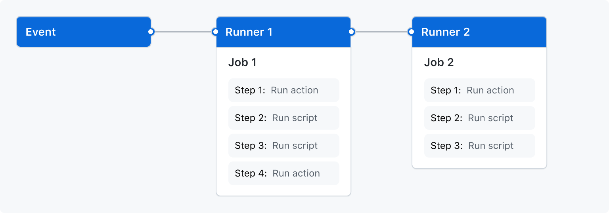

# GITHUB ACTIONS

## Understanding GitHub Actions

GitHub Actions is a CI/CD platform that allows you to automate your build, test, and deployment pipeline.
You can create `workflows` that build and test every pull request to your repository, or deploy merged pull requests to production.

GItHub provides Linux, Windows, and macOS virtual machines to run your workflows, or you can host your own self-hosted runners in your own data center or cloud infrastructure.

## The Components of GitHub Actions

You can configure GitHub Actions `workflow` to be triggered when an `event` occurs in your repository. Your workflow contains one or more `jobs` which can run in sequential order or in parallel. Each job will run inside its own vm `runner`, and has one or more `steps` that either run a script that you define or run an `action` which is a reusable extension that can simplify your workflow.

;

### Workflows

A workflow is a configurable automated process that will run one or more jobs. Workflows are defined by a YAML file checked in to your repository and will run when triggered by an event in your repository, or they can be truggerted manually, or at a defined schedule.

You can have multiple workflows in a repository, each perform a different set of steps.

### Events

An event is a specific activity in a repository that triggers a workflow run. For example, activity can originate from GitHub when someone creates a pull request, opens an issue, or pushes a commit to a repository. Workflows can be triggered on a schedule as well.

### Jobs

A job is a set of steps in a workflow that execute on the same runner. Each step is either a shell script that will be executed, or an action that will be run. Steps are executed in order and are dependent on each other. For example, you can have a step that builds your application followed by a step that tests the application that was built.

You can configure job's dependencies with other jobs. By default, jobs have no dependencies and run in parallel with each other. When a job takes a dependency on another job, it will wait for the dependent job to complete before it can run.

### Actions

Ab action is a custom application for the GitHub Actions platform that performs a complex but frequently repeated task. An action can pull your git repository from GitHub, set up the correct toolchain for your build environment, or set up the authentication to your cloud provider. You can write your own a actions or you can find actions to use in your workflows in the GitHub Marketplace.

### Runners

A runner is a server that runs your workflows when they're triggered. Each runner can run a single job at a time. GitHub provides Ubuntu Linux, Microsoft Windows, and macOS runners to run your workflows, each workflow ruin executes in a fresh, newly-provisioned virtual machine. You can also host your own runners.

## Create an example workflow

Each workflow is stored as a separate YAML file in your code repository, in a directory called `./github/workflows`

```yaml
name: learn-github-actions
on: [push]
jobs:
  check-bats-version:
    runs-on: ubuntu-latest
    steps:
      - uses: actions/checkout@v2
      - uses: actions/setup-node@v2
        with:
          node-version: '14'
      - run: npm install -g bats
      - run: bats -v
```
